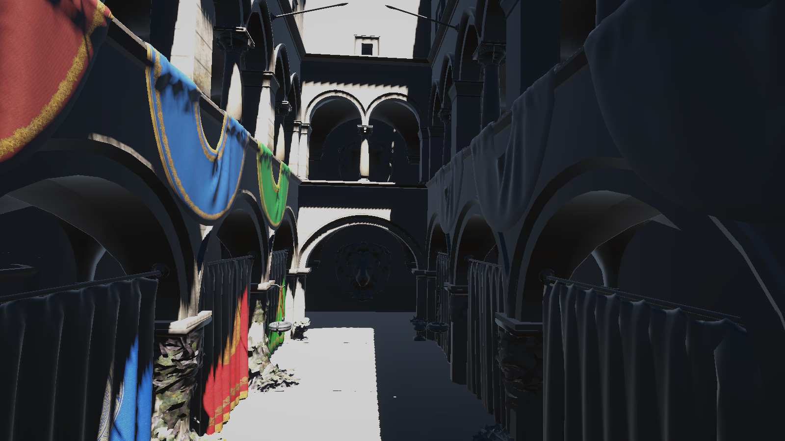
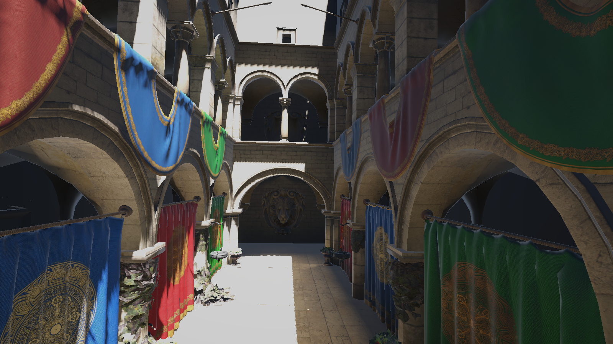
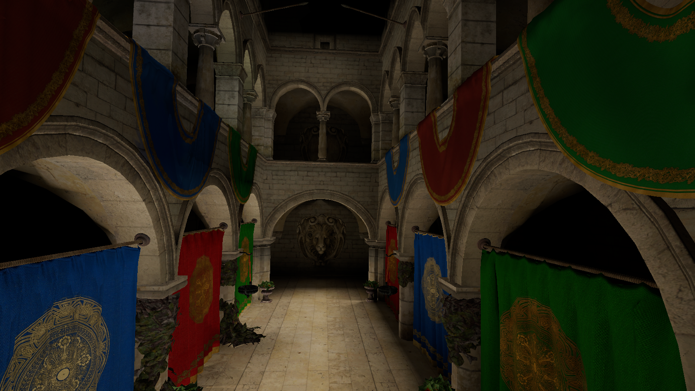
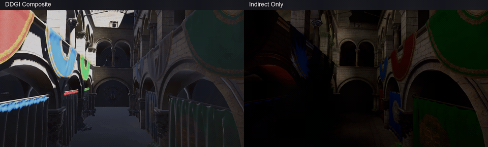
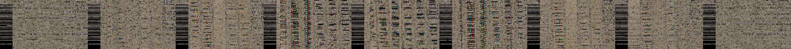
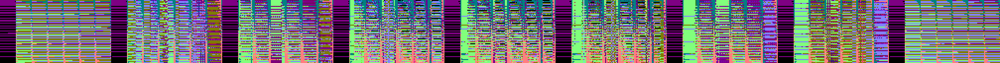
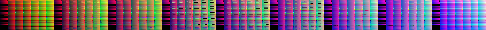
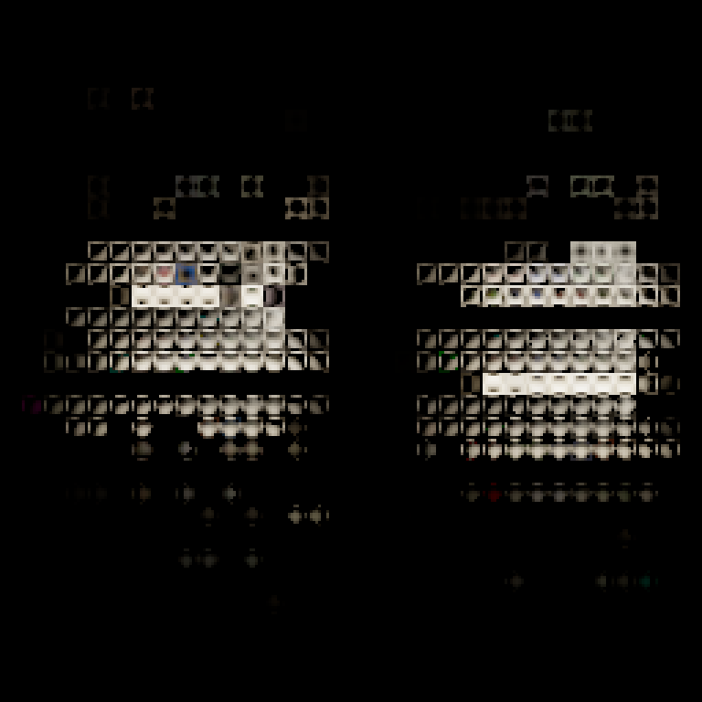
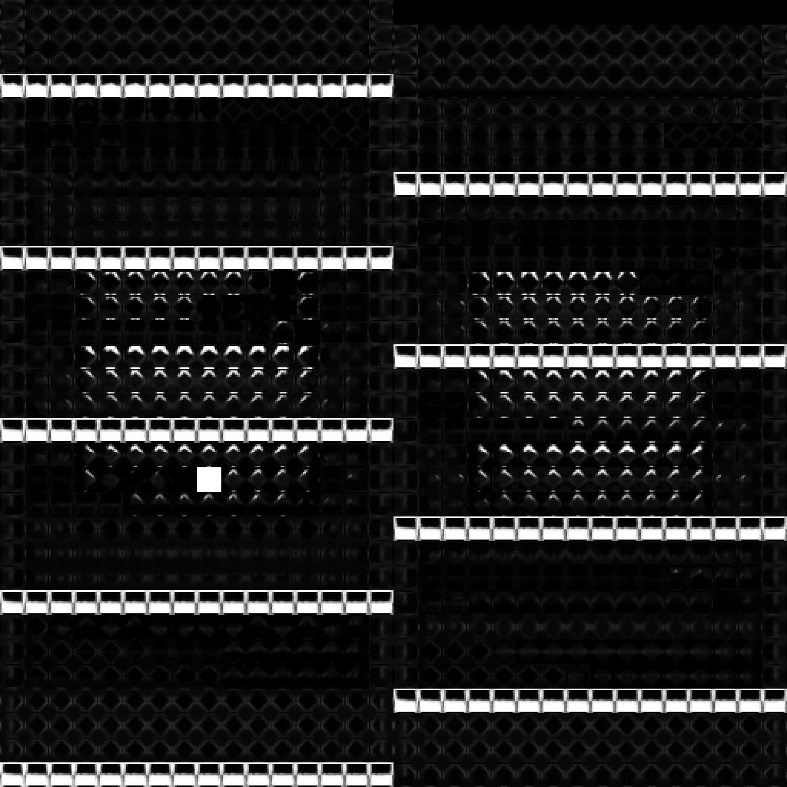

# Unity URP DDGI

基于 Unity URP 实现的动态漫反射全局光照方案。使用硬件光线追踪采集场景，通过 Compute Shader 更新八面体 Probe Atlas，并结合可见性加权插值、时间累积和跨帧反馈重建间接光照。

本项目为独立的 DDGI 学习与实验实现，不依赖 NVIDIA RTXGI SDK。早期 SH Probe GI 方案保留在仓库中，两套方案使用独立的代码、Shader 和 Renderer Feature。

[项目效果](#项目效果) · [核心实现](#核心实现) · [快速开始](#快速开始) · [算法流程](#算法流程) · [GPU 数据可视化](#gpu-数据可视化) · [调试与验证](#调试与验证)

## 项目效果

Sponza 场景，同一机位、光源与同一份已累积的 Volume 数据，输出分辨率为 `1600 x 900`：

| 关闭 DDGI | 开启 DDGI |
| --- | --- |
|  |  |

开启 DDGI 后，直接光阴影中的墙面、地面和布帘获得间接漫反射贡献。对比仅将两个 Volume 的 `Indirect Diffuse Intensity` 从 0 切换为 1，保留直接光与 URP 的其他光照项。

<details>
<summary>查看仅间接光视图</summary>



`IndirectOnly` 模式展示 DDGI 的间接漫反射贡献；没有有效表面深度的背景像素仍沿用原始场景背景。

</details>

图片直接从当前项目导出。机位、纹理尺寸和捕获记录见 [CaptureInfo.txt](pictures/ddgi/CaptureInfo.txt)，不作为性能基准或物理正确性验证。

### 动态光照演示

固定相机，主方向光按 **画面左侧 → 右侧 → 左侧** 完成一次往返。旋转中心对齐相机的水平视线，保留原光照仰角，绕世界 Y 轴摆动 **±45°**；首尾光源方向一致。视频左侧为最终场景，右侧为同一帧 Probe Atlas 重建的间接漫反射，可同时观察直接光阴影移动与 DDGI 的动态响应。



[高清对照视频（MP4，1920 × 580）](pictures/ddgi/DDGI_LightRotation.mp4) · [纯场景视频（MP4，1280 × 720）](pictures/ddgi/DDGI_LightRotation_Scene.mp4)

演示为 12 秒、360 帧，MP4 播放帧率为 30 fps；内嵌动图为 10 fps。录制前在左侧起始方向进行了 120 次 DDGI 更新预热，随后每个输出帧重新捕获、计算主光阴影与 Radiance，并更新 Probe Atlas；对照两侧共用该次更新结果，没有通过后期调亮画面模拟光照变化。时间累积可能使间接光响应滞后。

该视频采用离线逐帧导出，**30 fps 是播放帧率，不代表项目实测运行帧率**。录制后恢复原光源旋转、调试模式与自动更新设置；详细记录见 [VideoCaptureInfo.txt](pictures/ddgi/VideoCaptureInfo.txt)。

## 核心实现

| 模块 | 实现内容 |
| --- | --- |
| 场景采样 | 硬件光追、斐波那契球面射线、逐帧方向旋转；捕获 Position / Normal / Albedo，兼容静态合批子网格 |
| 命中点光照 | Blinn-Phong 直接光照、URP 主方向光 ShadowMap，以及上一帧 Volume 的间接漫反射反馈 |
| Probe 存储 | 八面体 Irradiance 与距离矩 Atlas，扩展一圈边界支持双线性采样 |
| 间接光重建 | 周围 8 个 Probe 的三线性插值、方向权重、切比雪夫可见性权重与 Surface Bias |
| 时间累积 | Irradiance 指数编码空间混合，距离矩线性混合，重新激活时重置单 Probe 历史 |
| 多 Volume | 按世界空间 Probe 密度排序，结合边界淡出与剩余覆盖率优先使用高密度结果 |
| 更新调度 | 七状态 Probe 状态机、动态几何影响区域检查、休眠 Probe 错峰复查 |
| 调试与展示 | 编辑器预览、间接光调试视图、GPU 状态统计，以及场景与 Buffer 自动导出 |

## 快速开始

当前项目版本为 **Unity 6000.0.67f1 / URP 17.0.4**。捕获需要 Windows、Direct3D 12，以及支持 Unity Ray Tracing Shader 的显卡和驱动。

仓库中的旧 GI 烘焙资产使用 Git LFS：

```bash
git lfs install
git clone https://github.com/doubingwen/DDGI.git
cd DDGI
git lfs pull
```

1. 使用 Unity Hub 打开项目，加载 `Assets/Scenes/SampleScene.unity`。
2. 确认图形 API 为 Direct3D 12；修改后重启 Unity。
3. 使用 URP **Deferred Renderer**，开启 **Compatibility Mode（关闭 Render Graph）**，启用 `DDGI Composite` Renderer Feature。
4. 检查 Volume 的捕获、Radiance 和 ProbeBlend Shader 引用；开启主方向光阴影，使相机 Shadow Distance 覆盖测试区域。
5. 固定建筑标记为 Static，移动物体不标记；关闭旧方案的 `Radiance Field Update` 与 `Radiance Field Composite`，避免叠加。
6. 开启 `Capture Volume Every Frame` 并进入 Play。编辑器预览还需开启 `Capture Volume In Edit Mode`，保持 Scene 视图打开。

关闭逐帧捕获时，Play 会在第一个有效 Game 相机渲染时初始化一次 Volume，但不持续更新。测试方向光动态响应应旋转光源，单纯平移方向光不会改变照明。

<details>
<summary>常用参数：间接光强度与时间累积</summary>

以下为脚本默认值，不一定等于已保存场景中的参数。

| 参数 | 默认值 | 作用 |
| --- | --- | --- |
| Rays Per Probe | 64 | 每个 Probe 每次更新的射线数 |
| Indirect Diffuse Intensity | 1 | 最终间接光显示强度；设为 0 关闭 DDGI 合成贡献 |
| Indirect Bounce Intensity | 1 | 上一帧间接光参与命中点光照计算的强度 |
| Enable Temporal Accumulation | 开启 | 混合当前 Probe 结果与历史 |
| Rotate Ray Directions | 开启 | 累积开启时逐帧改变采样方向 |
| Irradiance Hysteresis | 0.97 | Irradiance 历史权重，越大越稳定、响应越慢 |
| Distance Hysteresis | 0.9 | 距离矩历史权重 |
| Temporal Gamma | 5 | Irradiance 混合指数；1 表示线性混合 |
| Distance Sharpness | 50 | 距离矩积分的方向权重锐度 |

多 Volume 场景需分别检查强度。首帧不混合空历史；资源或布局变化时历史失效，也可用 `Reset Temporal History` 手动重置。

</details>

## 算法流程

```text
Probe 网格与场景加速结构
    -> 状态调度：确定需要更新的 Probe
    -> 光追求交：Position / Normal / Albedo
    -> 初始化或重新分类 Probe
    -> 命中点光照：直接光 + 主光阴影 + 上一帧间接光
    -> Ray Radiance
    -> ProbeBlend：Irradiance / 距离与距离平方
    -> 时间累积与八面体边界填充
    -> 8 Probe 可见性加权插值
    -> 多 Volume 混合与间接漫反射合成
```

### 跨帧多次弹射

每条 Probe 射线只记录首次命中，不递归追踪弹射。命中点 P 的间接光由上一帧 Volume 的 **Irradiance Atlas 与距离矩 Atlas** 估算：

```text
Radiance(P) = 直接光照(P，含主光阴影)
            + Albedo(P) / PI × 上一帧 Irradiance(P) × Indirect Bounce Intensity
```

新的 Radiance 再积分到本帧 Probe，使间接光跨帧传播并近似多次弹射。它与时间滤波不同：**反馈用于传播光照，历史混合用于稳定采样结果**。这是跨帧迭代近似，不等同于完整路径追踪。

### 可见性与时间累积

着色点采样周围 8 个 Probe，将三线性权重、方向权重和切比雪夫可见性权重的三次方相乘，再归一化。距离矩用于估计遮挡概率，Surface Bias 用于缓解表面自遮挡，最终按 `Albedo / PI × Irradiance` 计算间接漫反射。

Irradiance 在指数编码空间混合，Atlas 中仍保存线性结果：

```text
new = [(1 - alpha) × current^(1 / gamma) + alpha × previous^(1 / gamma)]^gamma
```

距离与距离平方使用相同的线性历史权重。较大的历史权重仍可能产生拖尾；指数混合不是完整的突变历史拒绝算法。

<details>
<summary>多 Volume：混合规则与 SampleScene 布局</summary>

高密度 Volume 优先，低密度 Volume 补充未覆盖的权重，避免多份 GI 直接相加：

```text
世界空间 Probe 密度 = 1 / (变换体积缩放 × spacing.x × spacing.y × spacing.z)
后续 Volume 有效权重 = remainingCoverage × boundaryWeight
```

`Boundary Blend Distance` 控制 Volume 内侧的世界空间线性淡出宽度。局部 Volume 的淡出带应被外围 Volume 覆盖；最外层 Volume 在边界淡出到零，归一化后仍保留覆盖率。

示例场景使用两个嵌套 Volume，Transform 为单位缩放、无旋转：

| Volume | 世界坐标中心 | Probe 网格 | 间距 | 覆盖尺寸 | 淡出宽度 |
| --- | --- | --- | --- | --- | --- |
| Building | (0.7, 6.0, -0.6) | 8 × 6 × 6，288 个 | (6, 4, 6) | 42 × 20 × 30 米 | 1 米 |
| Interior | (0.6, 3.5, -0.3) | 16 × 7 × 9，1008 个 | (2, 2, 2) | 30 × 12 × 16 米 | 1.5 米 |

Building 提供整体覆盖，Interior 提高中庭和主要室内区域的采样密度。共 1296 个 Probe，全量更新为 82944 根射线；实际计划更新数量以 Inspector 为准。

各 Volume 独立维护历史与多次弹射反馈，当前不跨 Volume 查询命中点的上一帧间接光。统一调试模式由密度最高且有有效数据的 Volume 决定。每个轴至少设置 2 个 Probe 才能形成三维采样区域。

</details>

<details>
<summary>Probe 状态机：分类、唤醒与历史重置</summary>

默认开启 `Enable Probe Classification`。分类使用 `gameObject.isStatic` 区分静态与动态 MeshRenderer，未标记 Static 的几何会按动态处理。GPU `uint2` Buffer 的 x 存状态，y 存更新与历史重置标志。

| 状态 | 行为 |
| --- | --- |
| Uninitialized | 发射初始化射线并分类 |
| Off | 保守判定在静态实体内部，不参与间接光插值 |
| Sleep | 远离近邻表面，保留 Atlas，跳过常规更新 |
| Awake | 靠近动态几何，持续更新 |
| Vigilant | 靠近静态表面，持续更新以响应光源变化 |
| NewAwake / NewVigilant | 首次激活，不使用失效历史；下一次更新转入常规状态 |

几何影响半径默认取 Probe cell 最长世界空间对角线，`Probe Influence Radius Scale` 可扩大范围。默认至少 95% 的全部射线命中背面、附近没有动态几何且靠近静态几何包围盒时，才判为 Off；该启发式假设网格封闭且法线朝外，薄片、开放网格或反向法线需要检查分类结果。

动态物体移动、禁用或移除时，新旧包围盒影响区域会重新检查。Sleep / Off 默认每 64 次 Volume 更新错峰复查；激活首帧不混合旧历史，也不把失效历史用于多次弹射反馈。

**几何静止不等于 Off。** 静态表面附近的 Vigilant 仍更新；因此表面密集的场景不保证从状态调度中获得明显提速。

Gizmo 颜色：Off 灰色、Sleep 暗黄色、Awake 橙色、Vigilant 绿色、NewAwake 紫色、NewVigilant 红色、Uninitialized 白色。

</details>

## GPU 数据可视化

下图从 Interior Volume 的实际 GPU RenderTexture 导出：1008 个 Probe、每个 Probe 64 根射线。原始 Ray Buffer 为 `64 × 1008`（横轴射线、纵轴 Probe）；预览转置为 **横轴 Probe、纵轴射线**，最近邻放大 2 倍。

### Ray G-Buffer

**Albedo：命中表面的漫反射颜色，线性颜色转为 sRGB；未命中为黑色。**



**Normal：世界空间法线，将 [-1, 1] 映射到 [0, 1]；未命中为黑色。**



**Position：世界空间 XYZ，在本次命中坐标范围内逐轴归一化显示。**



### 光照与阴影

**Radiance：命中点的直接光照与跨帧间接光反馈。**


**Main Light Visibility：主方向光 ShadowMap 可见性。**


Radiance 预览使用 `c / (1 + c)` 色调映射并转为 sRGB。可见性图中白色表示可见、灰色表示部分可见；黑色也可能是未命中、无效级联或未更新的 Probe，不能全部解释为遮挡。

### 八面体 Atlas

| Irradiance Atlas | Distance Moments Atlas：平均距离 |
| --- | --- |
|  |  |

| 数据 | 内部纹素 / 完整 tile | 本场景原始 Atlas | 展示方式 |
| --- | --- | --- | --- |
| Irradiance | 6 × 6 / 8 × 8 | 256 × 256 | 与 Radiance 相同的色调映射 |
| 距离矩 | 14 × 14 / 16 × 16 | 512 × 512 | 仅展示 R 通道的平均距离，除以最大射线距离转为灰度 |

距离矩 RG 分别保存平均距离与距离平方的平均值，图中不是方差或距离平方。Atlas 预览最近邻放大 3 倍；未使用的 tile 也可能是黑色，不能仅凭颜色判断 Probe 状态。

## 调试与验证

在 Volume Inspector 查看更新次数、累积帧数、纹理预览及以下状态：

| 检查项 | 用途 |
| --- | --- |
| Composite Runtime Status / Rendered Volume Count | 确认合成是否执行、参与的 Volume 数量 |
| Probe State Statistics (Async GPU) | 各状态数量，每约 0.5 秒刷新 |
| Scheduled Probe Updates / Scheduled Rays | 判断状态调度实际跳过多少工作 |
| Reclassify Probes | 请求全部重新分类 |
| Reset Temporal History | 清除历史有效性并重新累积 |

**重新导出图片：** 运行 Unity 菜单 `Dou DDGI > Export README Screenshots`。工具优先使用 Main Camera，冻结 Volume 更新进行同机位对比，结束后恢复强度、调试模式和更新开关，不保存临时参数。建议先等待时间累积稳定。

**重新录制视频：** 退出 Play，运行 `Dou DDGI > Record README Light Rotation`，录制期间不要修改场景。可用 `Cancel README Video Recording` 中止并恢复原参数。完成后在项目根目录执行下列命令，需要 FFmpeg 在 PATH 中；原始帧保存在不提交到仓库的 `Library/DDGI.VideoFrames`。

```powershell
pwsh -File Tools/Encode-DDGIDemo.ps1
```

**参考检查：** 在项目根目录使用 PowerShell 执行：

```powershell
pwsh -File Tools/Test-DDGIProbeStates.ps1
pwsh -File Tools/Test-DDGIVolumeBlending.ps1
pwsh -File Tools/Test-DDGISubMeshRanges.ps1
pwsh -File Tools/Test-DDGIShaderCompilation.ps1
```

前三项验证 CPU 参考逻辑，最后一项通过 Windows D3DCompile 检查四个 ProbeBlend / 分类 Kernel 的 SM5 编译兼容性；它们不能替代 Unity 中的 GPU 分类与画面验证。

**性能对比：** 保持相同机位、Volume 布局、射线数和显示设置，等待初始化结束，再用 Unity Profiler 比较分类开启/关闭的 CPU 与 GPU 帧时间。状态机减少实际 TraceRay 和部分计算，但仍有全网格 Dispatch、场景扫描、加速结构构建、历史复制及全屏合成开销；当前没有可报告的性能提升数据。

## 当前限制

- 阴影仅接入主方向光 ShadowMap；点光源和聚光灯参与 Radiance，但未接入对应阴影。
- ShadowMap 覆盖受相机级联影响，超出有效范围的 Probe 命中点不会获得主光直接贡献。
- 每个 Volume 独立扫描几何、构建加速结构并绘制全屏合成；未实现增量 AS、共享 AS、活动 Probe 压缩、更新预算和 Volume 裁剪。
- 未实现 SkinnedMeshRenderer 捕获、Probe 重定位和滚动 Volume。
- Blinn-Phong 光照与辐照度近似尚未完成统一能量标定，历史突变处理仍不完整；漏光、噪声和动态拖尾需结合场景持续验证。
