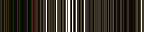
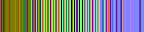
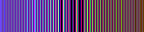

# Unity URP DDGI

基于 Unity URP 的实验性动态漫反射全局光照项目。使用硬件光线追踪采集 Probe 周围的场景信息，通过 Compute Shader 计算 Radiance、更新八面体映射 Atlas，并在运行时插值重建间接光照。

本项目用于学习和验证 DDGI 的核心流程，不依赖 NVIDIA RTXGI SDK。仓库保留了早期的 SH Probe GI 方案，DDGI 使用独立的代码、Shader 和 Renderer Feature。

## 已实现

- 规则 Probe Volume，默认为 `8 x 8 x 8`，每个 Probe 默认采样 64 根射线。
- 斐波那契球面采样与逐帧射线方向旋转。
- `RayTracingShader` 场景求交，生成 Position、Normal、Albedo 等 Ray G-Buffer。
- 在命中点计算 Blinn-Phong 直接光照，主方向光通过 URP ShadowMap 判断阴影。
- 采样上一帧 DDGI Volume，为命中点增加漫反射间接光，支持跨帧多次反弹反馈。
- ProbeBlend：每个 Probe 保存 `6 x 6` Irradiance 和 `14 x 14` 距离矩，扩展一圈边界后分别占用 `8 x 8`、`16 x 16` Atlas tile。
- 使用三线性插值、方向权重及切比雪夫可见性权重混合周围 8 个 Probe，并加入 Surface Bias 减少自遮挡。
- 时间累积：Irradiance 使用 gamma 空间混合，距离与距离平方使用相同权重线性混合。
- 运行时逐帧更新、编辑器 Scene 视图预览，以及纹理和间接光调试视图。
- 多 Volume 合成：按世界空间 Probe 密度排序，通过边界线性淡出和剩余覆盖率混合不同分辨率的 Volume。

## 整体流程

```text
Probe Volume / 场景加速结构
    -> 旋转斐波那契射线并与场景求交
    -> Ray G-Buffer（横轴为射线，纵轴为 Probe）
    -> 直接光照与主光阴影 + 上一帧 DDGI 间接光
    -> Ray Radiance
    -> ProbeBlend：八面体 Irradiance / 距离矩
    -> 历史混合与边界填充
    -> 8 Probe 可见性加权插值
    -> 漫反射间接光合成
```

时间累积与多次反弹反馈是两个不同步骤：前者稳定 Probe 的采样结果，后者使用上一帧 Volume 估算命中点接收到的间接光。

## 使用方法

项目使用 **Unity 6000.0.67f1 / URP 17.0.4**。光线追踪捕获需要 Windows、Direct3D 12，以及支持 Unity Ray Tracing Shader 的显卡和驱动。

大型旧 GI 烘焙资产通过 Git LFS 管理。安装 Git LFS 后克隆项目：

```bash
git lfs install
git clone https://github.com/doubingwen/DDGI.git
cd DDGI
git lfs pull
```

1. 用 Unity Hub 打开项目，加载 `Assets/Scenes/SampleScene.unity`。
2. 确认 Windows 图形 API 使用 Direct3D 12；修改图形 API 后需要重启 Unity。
3. 使用 URP **Deferred Renderer**，开启 **Compatibility Mode（关闭 Render Graph）**，并启用 `DDGI Composite` Renderer Feature。
4. 检查 `DDGI Probe Volume` 的捕获、Radiance 和 ProbeBlend Shader 引用，确保 Probe 网格覆盖需要计算 GI 的区域。
5. 开启主方向光阴影，并保证相机 Shadow Distance 能覆盖测试区域。关闭旧方案的 `Radiance Field Update` 与 `Radiance Field Composite` Feature，避免两套 GI 叠加。
6. 勾选 `Capture Volume Every Frame` 后进入 Play，即可逐帧更新。编辑器预览还需勾选 `Capture Volume In Edit Mode` 并打开 Scene 视图，空闲预览约每秒刷新 10 次。

关闭逐帧捕获时，Play 仍会在第一个有效 Game 相机渲染时初始化一次 Volume，但不会继续动态更新或累积更多样本。方向光的平移不改变照明，应通过旋转方向光测试动态响应。

## 时间累积参数

| 参数 | 默认值 | 作用 |
| --- | --- | --- |
| Rays Per Probe | 64 | 每个 Probe 每次更新发射的射线数 |
| Enable Temporal Accumulation | 开启 | 混合本次结果与历史 Probe 数据 |
| Rotate Ray Directions | 开启 | 累积开启时逐帧改变球面采样方向 |
| Irradiance Hysteresis | 0.97 | Irradiance 历史权重，越大越稳定，但光照响应越慢 |
| Distance Hysteresis | 0.9 | 距离矩历史权重 |
| Temporal Gamma | 5 | Irradiance 混合指数；设为 1 时采用线性混合 |
| Indirect Bounce Intensity | 1 | 上一帧间接光参与下一次 Radiance 计算的强度 |
| Indirect Diffuse Intensity | 1 | 最终间接光合成强度 |

Irradiance 使用以下混合公式，存回 Atlas 的结果仍为线性值：

```text
new = [(1 - alpha) * current^(1 / gamma) + alpha * previous^(1 / gamma)]^gamma
```

首帧直接使用当前结果，不混合空历史。资源或 Volume 布局变化时历史会失效，也可通过 Inspector 的 `Reset Temporal History` 手动重置。较大的历史权重仍可能产生拖尾，gamma 混合不等于完整的历史拒绝算法。

## 调试

在 Volume Inspector 中可以查看 `Recorded GI Updates`、`Accumulated Frames` 和 `Composite Runtime Status`，以及 G-Buffer、Radiance、主光可见性、Irradiance 和距离矩纹理。`IndirectOnly` 可以隔离观察间接光。

下面是早期单 Probe 捕获的调试图片，采用当时的 144 根射线配置，**不是最终 DDGI 场景效果图**：

| Albedo | Normal | Position |
| --- | --- | --- |
|  |  |  |

## 多 Volume

可以同时创建多个 `DDGI Probe Volume`。例如，大范围 Volume 使用间距 2 的 Probe，局部区域使用间距 1 的 Probe；各自开启逐帧捕获，并生成自己的网格与 Atlas。

- CPU 按 `1 / (世界变换体积缩放 x ProbeSpacing.x x ProbeSpacing.y x ProbeSpacing.z)` 从高密度到低密度排序，包含 Transform 缩放的影响。
- `Boundary Blend Distance` 控制 Volume 内侧的世界空间线性淡出宽度，默认 1。局部 Volume 的淡出带应被低密度 Volume 覆盖，宽度应小于最短边长度的一半。
- 高密度 Volume 优先，后续 Volume 的有效权重为 `remainingCoverage x boundaryWeight`，不是直接把多份 GI 相加。
- 最外层 Volume 在边界淡出到零；归一化后仍保留覆盖率，避免淡出被抵消。
- 各个 Volume 独立进行历史累积与多次反弹反馈；当前没有跨 Volume 查询命中点的上一帧间接光。统一调试模式由密度最高、已有有效数据的 Volume 决定。
- Inspector 的 `Rendered Volume Count` 可以确认参与合成的数量。Volume 每个轴至少设置 2 个 Probe，才能形成有体积的三维采样区域。

CPU 参考混合测试可执行 `pwsh -File Tools/Test-DDGIVolumeBlending.ps1`；该测试验证权重和边界公式，不代替 GPU 画面验证。

## 当前限制

- ShadowMap 阴影目前仅接入主方向光；点光源和聚光灯虽然参与 Radiance 计算，但尚未接入对应阴影。
- 主光 ShadowMap 由相机生成，覆盖范围受相机级联影响；超出有效级联的 Probe 命中点不会获得主光直接贡献。
- 每次更新扫描 MeshRenderer 并重建加速结构，尚未实现增量更新、Probe 更新预算和 SkinnedMeshRenderer 捕获。
- 尚未实现 Probe 重定位、分类和滚动 Volume。多 Volume 逐个绘制全屏合成，并独立重建加速结构，更新与合成开销随 Volume 数量增加，尚未加入裁剪和共享加速结构。
- 实验性 Blinn-Phong 光照和辐照度近似尚未完成统一的物理能量标定，也没有完整的突变历史拒绝策略。
- 64 根射线的稳定性、漏光、动态拖尾及实际 GPU 性能仍需结合具体场景验证。
